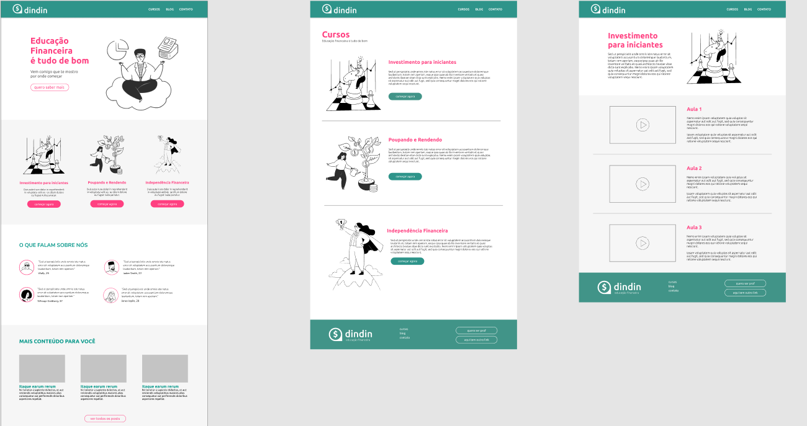

# Gama Academy Fullstack Web Developer #45 - Projeto-dindin !
### Projeto feito em grupo, utilizando os conhecimentos adquiridos no primeiro mês do curso de formação Gama XP.  
### O objetivo era recriar uma página sobre educação financeira, pegando como referência o layout do figma!
### Foi utilizado Html e Css.  
### Participaram desse projeto:  <a href="https://github.com/Jonas-Victor950" target="_blank" rel="noopener noreferrer">Jonas Victor</a> e  <a href="https://github.com/rafael-molina" target="_blank" rel="noopener noreferrer">Rafael Molina</a>.  
### Para demonstração do projeto <a href="https://williamnunes49.github.io/projeto-dimdim/" target="_blank" rel="noopener noreferrer">CLIQUE AQUI !</a>
  
## Projeto responsivo! 

